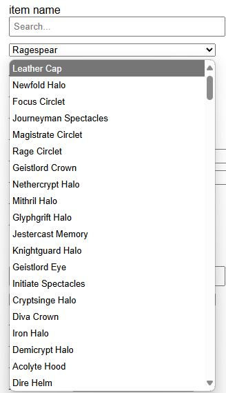

English | [繁體中文](README_TCH.md)

# ATLYSS Save Editor  
## Update
### Item Search
* Load config with [item_config.json](config/item_config.json)
* Item can use search to filter options
* More detailed item data can brwose [item_data.txt](data/only_level_item_data.txt)
* 
## How to Use  
* **Remember to back up your save files before proceeding.**  

1. Download [atlyss_save_editor.html](atlyss_save_editor.html) and open it in your browser.  
2. You can change the language by clicking "Select Language."  
3. *(Optional)* Click "Configuration File" to load a settings file for the save editor.  
4. Click "Load Folder" to select the save folder for ATLYSS.  
   * By default, the save files are located at:  
     ```[Your Steam installation path]\Steam\steamapps\common\ATLYSS\ATLYSS_Data\profileCollections```  
   * This script runs locally on your computer and does not upload any data to servers or external locations.  
5. Use "Select a file" to choose the file you want to edit.  
6. Once selected, the file will be loaded.  
7. Make the modifications you need.  
8. Click "Download Modified File" to save the edited file.  
   * The downloaded file needs to have the ```.json``` file extension removed.
9. Back up your save folder and store it in a safe place.  
10. Replace the original save file in the save folder with the modified file.  
11. Launch the game and enjoy your edits!  
